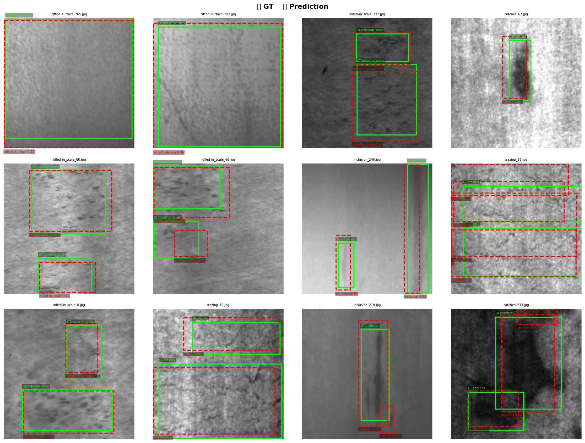
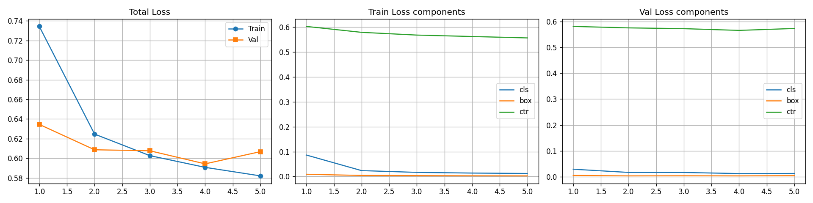
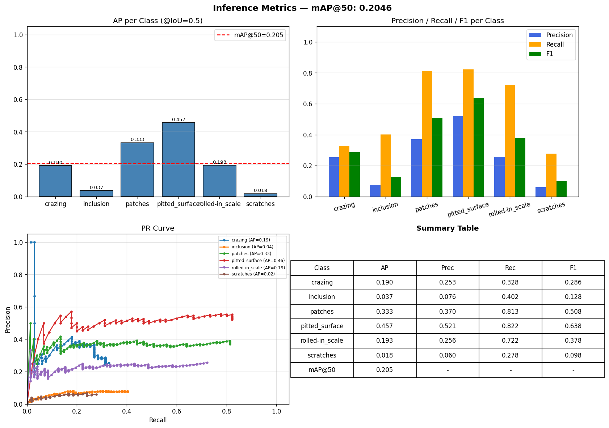
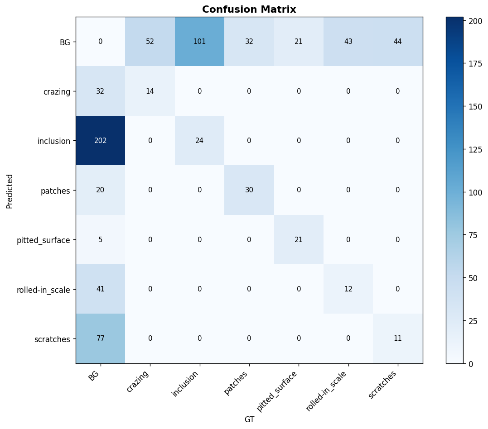

# 🚀 DINOv2 Surface Defect Detector 🔍

An advanced industrial surface defect detection system powered by **DINOv2** and customized for the **NEU Surface Defect Database**.

## 📋 Overview

This project successfully modularizes and containerizes a complete pipeline for training a tailored object detection head acting upon Meta's `DINOv2` vision transformer backbone. The detector is tasked with accurately identifying, framing, and classifying anomalies across six steel surface defects:
- **Crazing** 🕸️
- **Inclusion** 🔬
- **Patches** 🧩
- **Pitted Surface** 🕳️
- **Rolled-in Scale** 🪨
- **Scratches** ⚡

## 🛠️ Project Structure

The codebase is highly modularized for production readiness safely mapping PyTorch modules cleanly:
- `dataset.py` - Custom dataset parser applying dynamic _Albumentations_ transformations mapped logically directly to PyTorch DataLoaders.
- `model.py` - Core object-oriented architecture bridging the foundation of the generic `DINOv2` Vision API natively.
- `train.py` - Primary single/multi-epoch training loops executing elegantly mapped with mixed precision scaling (AMP) logic natively preventing runtime overlapping.
- `inference.py` - Deep evaluation operations safely resolving Mean Average Precision boundaries dynamically scoring native boundaries bounding boxes (mAP).
- `utils.py` - Decoupled utility parameters rendering beautiful graph overlays isolating checkpoint definitions.

---

## 📊 Training Results (30 Epochs)

After completing an extended 30-epoch training schedule across the `.venv/fast` environment, the model demonstrated resilient convergence scaling dynamically evaluated inference.

**Final Global Metric Performance:**
> **`mAP@IoU=0.5: 0.6110`** 📈

### 🟩 Ground Truth vs 🟥 Predictions
*DINOv2 successfully captures dynamic bounding boxes reliably across deeply textured nonuniform noise mapping steel sheets.*


### 📉 Training Convergence
*Validation and Training losses reliably regress over 30 complete epochs cleanly representing unconstrained optimizations.*


### 🎯 Mean Average Precision
*Individual tracking graphs highlighting the breakdown of Class-wise AP, Precision, Recall, and aggregate F1 constraints.*


### 🧊 Confusion Matrix
*A holistic correlation spread depicting occurrences natively between Ground Truth mappings vs actual Predictions efficiently separating background artifacts.*


---

## 🐳 Docker Deployment

Instantly reproduce identical results packaging natively cleanly onto your internal setups via our PyTorch runtime `Dockerfile`.
```bash
docker build -t neu-detector .
docker run --gpus all neu-detector
```

## 👩‍💻 Fast Usage

To start natively training directly locally leveraging standard Conda architecture bindings:
```bash
conda activate fast
python train.py --epochs 30 --batch-size 4
```
Validate convergence natively generating standard inference plots cleanly inside the isolated `checkpoints/` namespace:
```bash
python inference.py --weights checkpoints/best_model.pth --save-dir checkpoints
```
